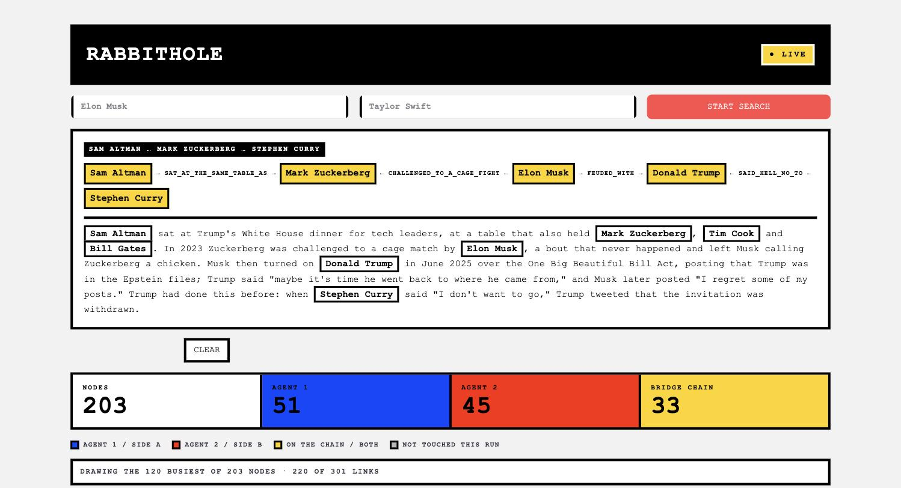

# RabbitHole

Type two famous names. Two research agents dig outward from one name each — feuds, exes,
diss tracks, unfollows, lawsuits, whatever the internet is saying — writing everything they
find into one shared Neo4j graph. The run ends when the graph holds a chain between the two
names. Then Claude tells you how that chain happened.

Nothing is fact-checked. A chain through a tabloid rumour is the point.



## The demo

1. **Two names in.** `START SEARCH` launches a `/bridge` run in the background.
2. **Watch it dig.** The graph refreshes every 5 seconds. Blue is what agent 1 has written,
   red is agent 2, grey is left over from an earlier pair. Gold means the node sits on a
   chain between the two names.
3. **Click a gold node.** The chain it bridges is drawn as pills and highlighted in the
   graph. `TELL THE STORY` has Claude read the source page behind every hop and write what
   happened — every name on the chain gets its own sentence. Clicking a relationship line
   does the same for that single link.
4. **`▶ REPLAY HOW IT GREW`** walks the graph back through the order it was written in, one
   link at a time.

The same run can be started from a terminal in this folder: `claude -p "/bridge Sam Altman | Stephen Curry"`.

## How it works

Three levels of agent, and page bodies never reach the top two:

```
main agent  (/bridge)              runs rounds, checks the graph, writes the report
├── frontier-researcher  side a    searches the web and X, extracts names + relations
│   ├── page-explorer              reads one page
│   └── pdf-reader                 reads one paper
└── frontier-researcher  side b    the same, digging from the other name
```

Each round the main agent sends both researchers up to 3 terms to expand, in parallel. A
researcher searches, dispatches its own explorers at the best URLs, turns what comes back
into `subject —relation→ object` records, and writes them. The run stops when a chain exists,
when 20 expansions are spent, or when both sides come back empty twice.

### The graph

One node label, one relationship type. The schema is fixed in `graph.py` rather than left to
the agents, so the two queries the demo turns on — has it met, and what is the chain — run
over a predictable shape.

```
(:Entity {key, name, sides, depth, expanded, seed})
(:Entity)-[:RELATED {type, source_url, snippet, side, round}]->(:Entity)
```

`key` is the lowercased name and the identity, so `OpenAI` and `openai` are one node while
`Open AI` is a different one — name drift is the main way a run fails to connect. Every edge
carries the URL that claimed it. **The graph is never cleared**: each run resets only its own
three properties (`sides`, `expanded`, `seed`), so a later pair can turn out to be connected
through edges an earlier run wrote.

### What the colours mean

| | |
|---|---|
| blue / red | this run's agents wrote this node |
| grey | this run never touched it — it is here from an earlier pair |
| **gold** | the node sits on *some* chain (≤ 6 hops) between the two seeds |

Gold is computed by walking the graph, not by who wrote the node: a chain often closes
through an edge an earlier run wrote, leaving the node it passes through marked by one side
only.

## Setup

```bash
make setup             # venv + deps, renders .mcp.json for this folder's path
cp .env.example .env   # Firecrawl key + Neo4j credentials
make check             # proves every MCP server speaks MCP
make dashboard         # http://localhost:8501
```

Then run `claude` here once interactively and accept the trust dialog, or
`.claude/settings.json` is ignored and every tool call prompts. If you move the folder,
re-run `make render`.

Claude writes the stories through the Anthropic SDK when `ANTHROPIC_API_KEY` is set, and
otherwise through the local Claude Code CLI — so it works with no key configured.

## What is where

| | |
|---|---|
| `app.py` | the dashboard: graph, story box, search form, replay |
| `components/graph_click/` | the bridge that lets a click inside the graph reach Python |
| `.claude/skills/bridge/` | the main agent: rounds, dispatch, stop conditions, report |
| `.claude/agents/` | `frontier-researcher`, `page-explorer`, `pdf-reader` |
| `servers/mcp_servers/graph_server/` | `bridge_start`, `graph_add`, `frontier`, `bridge_status` |
| `servers/mcp_servers/websearch_server/` | Firecrawl: `search` for the director, `scrape` for the explorer |
| `search/<run-id>/` | one directory per run: the pages read, the report, credits spent |

MCP servers, from `.mcp.json`:

| server | tools | who calls it |
|---|---|---|
| `graph` | `bridge_start`, `graph_add`, `frontier`, `bridge_status` | main agent + researchers |
| `websearch` | `search` | researchers |
| `explorer` | `scrape`, `interact` | page-explorer only |
| `x` | `search` | researchers — recent names and events |

X is not in this folder: `render.sh` points at the vendored server in a sibling
`claude-toolkit/servers/x`, which holds the browser login. Pass
`X_ROOT=/path/to/servers/x make render` if it lives elsewhere. Its director profile ships
every write tool X has; the researcher's tool list admits only `search`, and
`.claude/settings.json` denies the rest.

## Numbers to know

| | |
|---|---|
| Firecrawl | 1 credit per search, ~2 per page read; a full run is 60–150 |
| A run | 20 expansions, 3–4 rounds, under ten minutes |
| Chain search | every simple path up to `CHAIN_HOPS = 6`, pruned by distance — 2 ms on 300 edges |
| Drawn | the `DISPLAY_NODES = 120` busiest, plus every node on a chain and both seeds |
| Neo4j | Aura free tier: 200k nodes, 400k relationships |

## Known limits

- **X posts cannot be read**, only searched: the vendored scraper returns engagement counts
  with no body text. X reaches the graph through `x:search`, whose results do carry each
  post's text.
- **A story takes 10–20 seconds** through the CLI path. It is cached per chain, and the
  graph refreshes in a fragment so the page around it does not reload mid-sentence.
- **Names are matched exactly** after lowercasing. Two spellings of one person are two nodes
  and will never meet.
